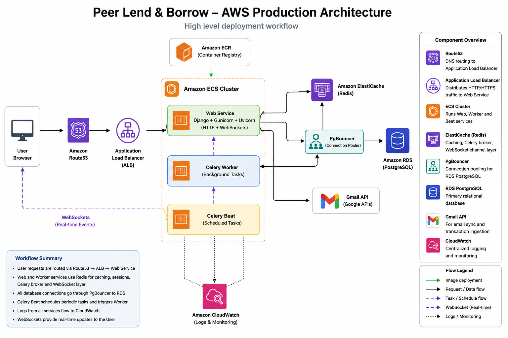

# Project Deployment Guide

This document is the authoritative production deployment guide for this repository.

It documents the complete deployment of this application to AWS, from local build to a live HTTPS endpoint, using the actual implementation and running infrastructure observed in this project.

Scope covered:

- Architecture and deployment pipeline
- AWS resources and configuration
- Docker and image publishing to ECR
- ECS services for web, worker, beat, and PgBouncer
- RDS PostgreSQL and ElastiCache Redis connectivity
- WebSocket and Celery runtime deployment
- Operational verification, troubleshooting, and rollback

Production domain currently in use:

- https://thejus.fun

---

# Deployment Overview

The deployment flow implemented for this project is:

Developer  
↓  
Docker  
↓  
Amazon ECR  
↓  
Amazon ECS  
↓  
Application Load Balancer  
↓  
Route53  
↓  
HTTPS  
↓  
Application  
↓  
PgBouncer  
↓  
Amazon RDS PostgreSQL  
↓  
Redis  
↓  
Celery Worker  
↓  
Celery Beat  
↓  
CloudWatch

Operationally, the deployment consists of four ECS services in one cluster:

- nance-web-service
- nance-worker-service
- nance-beat-service
- nance-pgbouncer-service

The web service is fronted by an internet-facing ALB and Route53 alias record for the custom domain.

---

# AWS Architecture Diagram


<p align="center">
  
</p>

<p align="center">
<b>Figure 1. AWS Production Architecture(workflow)</b>
</p>

<p align="center">
  
</p>

<p align="center">
<b>Figure 2. AWS Production Architecture</b>
</p>

Network segmentation in the deployed VPC:

- VPC CIDR: 10.0.0.0/16
- Public subnets (ALB):
  - 10.0.1.0/24 (ap-south-1a)
  - 10.0.2.0/24 (ap-south-1b)
- Private app subnets (ECS services):
  - 10.0.11.0/24 (ap-south-1a)
  - 10.0.12.0/24 (ap-south-1b)
- Private DB subnets (RDS/Redis subnet groups):
  - 10.0.21.0/24 (ap-south-1a)
  - 10.0.22.0/24 (ap-south-1b)

---

# AWS Resources Created

This section lists each AWS component used by the live deployment, with purpose, configuration, and interaction path.

## 1. VPC

Purpose:

- Isolates all networking resources for the stack.

Configuration:

- VPC ID: vpc-0a89d647923776633
- CIDR: 10.0.0.0/16

Why required:

- Provides controlled east-west traffic for app, DB, cache, and load balancer.

Interaction:

- ALB, ECS tasks, RDS, and Redis all run inside this VPC.

## 2. Subnets

Purpose:

- Separate internet-facing and internal workloads.

Configuration:

- Public:
  - subnet-08fd1d44cc0661510 (10.0.1.0/24, ap-south-1a)
  - subnet-0dda4bc55e0aebd25 (10.0.2.0/24, ap-south-1b)
- Private app:
  - subnet-0d41461b1d3a491c9 (10.0.11.0/24, ap-south-1a)
  - subnet-03a6c2c4680648a6e (10.0.12.0/24, ap-south-1b)
- Private DB/cache:
  - subnet-00a56c266ec438df8 (10.0.21.0/24, ap-south-1a)
  - subnet-0fa9286a79aa3523a (10.0.22.0/24, ap-south-1b)

Why required:

- ALB must be publicly reachable; app/database/cache should not be directly internet exposed.

Interaction:

- ALB in public subnets forwards to ECS tasks in private app subnets.
- RDS and Redis are reachable from app security groups in DB subnet groups.

## 3. Security Groups

Purpose:

- Enforce least-privilege traffic between layers.

Configuration and interaction:

- nance-alb-sg (sg-0bb6944b8e436dd63)
  - Inbound: TCP 80, 443 from 0.0.0.0/0
  - Outbound: TCP 8000 to nance-ecs-sg
- nance-ecs-sg (sg-0740ecc9d1a650317)
  - Inbound: TCP 8000 from nance-alb-sg
  - Outbound: all
- nance-pgbouncer-sg (sg-0aa1ab7199cf71065)
  - Inbound: TCP 6432 from nance-ecs-sg
  - Outbound: all
- nance-rds-sg (sg-0d1c6b1304cd7236f)
  - Inbound: TCP 5432 from nance-ecs-sg and nance-pgbouncer-sg
  - Outbound: all
- nance-redis-sg (sg-0c1b92e92e5d2142b)
  - Inbound: TCP 6379 from nance-ecs-sg
  - Outbound: all

Why required:

- Prevents direct DB/cache access from the internet while allowing application traffic.

## 4. Application Load Balancer

Purpose:

- Public ingress for HTTP/HTTPS traffic and target health management.

Configuration:

- ALB name: nance-alb
- DNS: nance-alb-1091818057.ap-south-1.elb.amazonaws.com
- Scheme: internet-facing
- Listeners:
  - 80 HTTP -> forward to target group
  - 443 HTTPS -> forward to target group
- Target group: nance-web-tg
  - Target type: ip
  - Port: 8000
  - Health check path: /app/login/

Why required:

- Required for internet access, TLS termination, and ECS target registration.

Interaction:

- Forwards internet traffic to nance-web-service container port 8000.

## 5. Route53

Purpose:

- Maps custom domain to ALB.

Configuration:

- Hosted zone: thejus.fun
- Record:
  - A alias thejus.fun -> dualstack.nance-alb-1091818057.ap-south-1.elb.amazonaws.com

Why required:

- Stable production domain.

Interaction:

- Browser resolves thejus.fun to ALB.

## 6. Certificate Manager (ACM)

Purpose:

- Provides TLS certificate for HTTPS.

Configuration:

- Certificate ARN:
  - arn:aws:acm:ap-south-1:212669912501:certificate/6ba55e36-5be4-4e54-a2a5-aa3e576710e2
- Domains:
  - thejus.fun
  - *.thejus.fun
- Status: ISSUED
- InUse: true

Why required:

- Enables HTTPS on ALB listener 443.

Interaction:

- ALB terminates TLS using ACM certificate.

## 7. Amazon ECR

Purpose:

- Stores deployable container images.

Configuration:

- nance-web
  - URI: 212669912501.dkr.ecr.ap-south-1.amazonaws.com/nance-web
- nance-pgbouncer
  - URI: 212669912501.dkr.ecr.ap-south-1.amazonaws.com/nance-pgbouncer
- Scan on push: enabled

Why required:

- ECS pulls immutable image artifacts from ECR.

Interaction:

- Task definitions reference ECR image URIs.

## 8. ECS Cluster

Purpose:

- Runs all services on AWS Fargate.

Configuration:

- Cluster: nance-cluster
- Capacity providers: FARGATE, FARGATE_SPOT
- Active services: 4
- Running tasks: 4

Why required:

- Orchestrates service lifecycle and rolling deployments.

Interaction:

- Hosts web, worker, beat, and pgbouncer services.

## 9. ECS Task Definitions

Purpose:

- Defines runtime for each containerized service.

Configuration (current revisions):

- nance-web:18
  - CPU: 1024
  - Memory: 2048
  - Container: web
  - Image: nance-web:latest
  - Command: /app/scripts/start-web.sh
  - Port mapping: 8000
  - Logs: /ecs/nance-web
- nance-worker:13
  - CPU: 1024
  - Memory: 2048
  - Container image: nance-web:latest
  - Command: /app/scripts/start-worker.sh
  - Logs: /ecs/nance-worker
- nance-beat:12
  - CPU: 1024
  - Memory: 2048
  - Container image: nance-web:latest
  - Command: /app/scripts/start-beat.sh
  - Logs: /ecs/nance-beat
- nance-pgbouncer:1
  - CPU: 2048
  - Memory: 7168
  - Container: pgbouncer
  - Image: nance-pgbouncer:latest
  - Port mapping: 6432
  - Logs: /ecs/nance-pgbouncer

Why required:

- Enables independent deployment and scaling of web and background processors.

Interaction:

- Worker and beat use same app image with different commands.
- All app tasks connect to Redis and PgBouncer.

## 10. ECS Services

Purpose:

- Maintains desired task count and deployment rollout.

Configuration:

- nance-web-service
  - Desired/Running: 1/1
  - Task def: nance-web:18
  - ALB attached target group
  - Health grace period: 120s
  - Deployment config: min healthy 100, max 200
- nance-worker-service
  - Desired/Running: 1/1
  - Task def: nance-worker:13
- nance-beat-service
  - Desired/Running: 1/1
  - Task def: nance-beat:12
- nance-pgbouncer-service
  - Desired/Running: 1/1
  - Task def: nance-pgbouncer:1
  - Service discovery registry: pgbouncer

Why required:

- Keeps each role alive and allows rolling updates.

Interaction:

- Web receives traffic via ALB.
- Worker/beat consume Redis queues and scheduler state.
- PgBouncer is discovered internally as pgbouncer.nance.local.

## 11. CloudWatch Logs

Purpose:

- Centralized operational logs.

Configuration:

- /ecs/nance-web
- /ecs/nance-worker
- /ecs/nance-beat
- /ecs/nance-pgbouncer

Why required:

- Required for troubleshooting failed deployments and runtime incidents.

Interaction:

- awslogs driver in each task definition sends stdout/stderr to CloudWatch.

## 12. ElastiCache Redis

Purpose:

- Shared in-memory broker/cache/channel backend.

Configuration:

- Cluster ID: nance-redis-001
- Engine: Redis 7.1.0
- Node type: cache.t3.micro
- Endpoint: nance-redis-001.uop2pj.0001.aps1.cache.amazonaws.com:6379
- Security group: nance-redis-sg
- Subnet group: nance-redis-subnet-group

Why required:

- Celery broker/result backend
- Django cache backend for health check and caching
- Channels redis layer for websocket groups

Interaction:

- Web, worker, and beat all use REDIS_URL.

## 13. RDS PostgreSQL

Purpose:

- Primary relational database.

Configuration:

- Active application DB instance:
  - Identifier: nance-db
  - Engine: postgres
  - Class: db.t3.micro
  - Endpoint: nance-db.cbs804uayfdo.ap-south-1.rds.amazonaws.com:5432
  - Storage encrypted: true
  - PubliclyAccessible: true
  - SG: nance-rds-sg
- Additional Aurora resource also exists in account:
  - Cluster: database-1 (aurora-postgresql)
  - Not used by current ECS task DATABASE_URL

Why required:

- Persistent storage for all app models.

Interaction:

- App and background tasks connect through PgBouncer endpoint, which forwards to nance-db.

## 14. PgBouncer

Purpose:

- Connection pooling layer between ECS and PostgreSQL.

Configuration:

- Deployed as dedicated ECS service and task
- Internal DNS via Cloud Map service: pgbouncer.nance.local
- App DATABASE_URL points to pgbouncer.nance.local:6432

Why required:

- Stabilizes DB connections under process and task fanout.

Interaction:

- Web/worker/beat -> PgBouncer -> RDS PostgreSQL.

## 15. IAM Roles

Purpose:

- Allows ECS tasks to pull images and write logs.

Configuration:

- nance-ecs-task-execution-role
- ecsTaskExecutionRole
- Attached policy:
  - AmazonECSTaskExecutionRolePolicy

Why required:

- Required for ECR image pull and CloudWatch logs write.

Interaction:

- Referenced by task definitions executionRoleArn.

## 16. Secrets and Environment Variables

Purpose:

- Parameterize runtime behavior.

Current implementation note:

- In current task definitions, values are defined as environment variables.
- secrets field is null in the observed task definitions.
- Assignment requirement asks for SSM/Secrets Manager usage; this is a recommended improvement for sensitive values.

Interaction:

- Django, Celery, Redis, JWT, CORS, Gmail OAuth behavior are configured through env variables.

---

# Docker

## Dockerfile

Main application image:

- Base: python:3.12-slim
- Installs build-essential and libpq-dev
- Installs Python dependencies from requirements.txt
- Copies full repository
- Makes startup scripts executable
- Working directory: /app/src

Operational consequence:

- Same image is reused for web, worker, and beat.

## docker-compose.yml

Local orchestration defines:

- db: postgres:16
- redis: redis:7
- web: app image, start-web.sh
- worker: app image, start-worker.sh
- beat: app image, start-beat.sh

Why multiple containers are used:

- Web handles HTTP/ASGI traffic.
- Worker processes asynchronous Celery tasks.
- Beat schedules periodic tasks.
- Splitting roles isolates failure domains and improves scaling flexibility.

## Container layout in production ECS

- Web service:
  - command /app/scripts/start-web.sh
  - runs migrations, collectstatic, then Gunicorn+Uvicorn worker
- Worker service:
  - command /app/scripts/start-worker.sh
- Beat service:
  - command /app/scripts/start-beat.sh
- PgBouncer service:
  - dedicated pgbouncer image

Images used:

- Web/worker/beat image:
  - 212669912501.dkr.ecr.ap-south-1.amazonaws.com/nance-web:latest
- PgBouncer image:
  - 212669912501.dkr.ecr.ap-south-1.amazonaws.com/nance-pgbouncer:latest

---

# Amazon ECR

## Repository creation

Create repositories once per account/region:

```powershell
aws ecr create-repository --repository-name nance-web --region ap-south-1
aws ecr create-repository --repository-name nance-pgbouncer --region ap-south-1
```

## Authentication

Authenticate Docker to ECR before push:

```powershell
aws ecr get-login-password --region ap-south-1 | docker login --username AWS --password-stdin 212669912501.dkr.ecr.ap-south-1.amazonaws.com
```

What this does:

- Requests a short-lived auth token from ECR.
- Passes token to Docker login for registry authentication.

## Build, tag, and push workflow

Application image:

```powershell
docker build -t nance-web:latest .
docker tag nance-web:latest 212669912501.dkr.ecr.ap-south-1.amazonaws.com/nance-web:latest
docker push 212669912501.dkr.ecr.ap-south-1.amazonaws.com/nance-web:latest
```

PgBouncer image:

```powershell
docker build -f infra/pgbouncer/Dockerfile -t nance-pgbouncer:latest infra/pgbouncer
docker tag nance-pgbouncer:latest 212669912501.dkr.ecr.ap-south-1.amazonaws.com/nance-pgbouncer:latest
docker push 212669912501.dkr.ecr.ap-south-1.amazonaws.com/nance-pgbouncer:latest
```

Command-by-command explanation:

- docker build:
  - Creates local image from Dockerfile.
- docker tag:
  - Assigns ECR registry/repository/image:tag reference.
- docker push:
  - Uploads image layers to ECR.

Verification:

```powershell
aws ecr describe-images --repository-name nance-web --region ap-south-1
aws ecr describe-images --repository-name nance-pgbouncer --region ap-south-1
```

---

# ECS Deployment

## Cluster creation

Cluster in use:

- nance-cluster

Typical creation command:

```powershell
aws ecs create-cluster --cluster-name nance-cluster --region ap-south-1
```

## Task Definition

Each role has its own task definition family:

- nance-web
- nance-worker
- nance-beat
- nance-pgbouncer

Core settings used:

- Network mode: awsvpc
- Launch: Fargate
- Logs: awslogs to /ecs/* groups

## Container definitions

Web:

- image: nance-web:latest
- command: /app/scripts/start-web.sh
- port: 8000

Worker:

- image: nance-web:latest
- command: /app/scripts/start-worker.sh

Beat:

- image: nance-web:latest
- command: /app/scripts/start-beat.sh

PgBouncer:

- image: nance-pgbouncer:latest
- port: 6432

## Environment variables

Web/worker/beat task definitions include environment values for:

- Django settings mode
- DB URL (via PgBouncer)
- Redis URL
- JWT lifetimes
- CORS/CSRF host policy
- Gmail integration URLs and credentials

Important hardening note:

- Sensitive values should be moved from plain environment to Secrets Manager or SSM Parameter Store references.

## CPU and memory

Current observed allocations:

- web: 1024 CPU, 2048 MB
- worker: 1024 CPU, 2048 MB
- beat: 1024 CPU, 2048 MB
- pgbouncer: 2048 CPU, 7168 MB

## Port mapping

- web: containerPort 8000
- pgbouncer: containerPort 6432

Worker and beat are internal-only workload containers.

## Service creation

Services currently deployed:

- nance-web-service (with ALB target group)
- nance-worker-service
- nance-beat-service
- nance-pgbouncer-service (with Cloud Map registration)

## Rolling deployment

Current deployment controller and config:

- deploymentController: ECS
- minimumHealthyPercent: 100
- maximumPercent: 200

Update behavior:

- New task definition revision is registered.
- ECS starts new tasks and drains old tasks according to deployment settings.
- Web deployment completion can be observed via rolloutState COMPLETED.

## Screenshot placeholders

- [Screenshot Placeholder] ECS cluster services overview
- [Screenshot Placeholder] Task definition revision details
- [Screenshot Placeholder] Service events during rollout
- [Screenshot Placeholder] ALB target health screen

---

# PgBouncer

This section explains the deployed PgBouncer layer in detail.

## Why PgBouncer is required

Without pooling, each process/worker tends to hold its own PostgreSQL connection(s). In containerized systems, this can scale quickly as:

- Gunicorn workers increase
- Celery workers increase
- ECS task count increases

PostgreSQL max_connections is finite, and unmanaged client fanout can lead to:

- connection exhaustion
- elevated latency
- failed request spikes

PgBouncer solves this by multiplexing many client connections onto a bounded number of server connections.

## Connection exhaustion in ECS context

ECS scaling horizontally multiplies app processes. For each additional task revision or scale-out event, potential DB client connections increase. PgBouncer decouples client connection count from backend PostgreSQL connections.

## Pooling mode

Current configuration uses:

- pool_mode = transaction

Meaning:

- A backend connection is assigned per transaction and returned immediately when transaction completes.

Why this mode:

- Maximizes reuse and reduces server-side connection footprint.
- Well-suited for stateless web and worker DB access patterns.

## Current PgBouncer configuration

From infra/pgbouncer/pgbouncer.ini:

- listen_addr = 0.0.0.0
- listen_port = 6432
- auth_type = plain
- auth_file = /etc/pgbouncer/userlist.txt
- pool_mode = transaction
- max_client_conn = 500
- default_pool_size = 20
- reserve_pool_size = 5
- ignore_startup_parameters = extra_float_digits
- server_reset_query = DISCARD ALL
- admin_users = peer_user

Database mapping section:

- peer_platform = host=nance-db.cbs804uayfdo.ap-south-1.rds.amazonaws.com port=5432 dbname=peer_platform

## Parameter-by-parameter explanation

listen_addr:

- Binds PgBouncer to all interfaces in the container so ECS networking can reach it.

listen_port:

- Port used by app tasks in DATABASE_URL.

auth_type plain:

- Password authentication using static userlist file.
- Functional for current setup, but use encrypted auth mechanisms and secret distribution for production hardening.

auth_file:

- Local file containing database user credentials used for backend auth.

pool_mode transaction:

- Returns backend connection at transaction boundary for high reuse.

max_client_conn = 500:

- Upper bound of client sockets accepted by PgBouncer.
- Allows many idle/short-lived client sessions without opening 500 DB connections.

default_pool_size = 20:

- Max server connections per pool (db/user pair).
- This is the primary cap for active backend connections.

reserve_pool_size = 5:

- Temporary overflow pool under pressure.
- Helps absorb spikes without immediate client failures.

ignore_startup_parameters = extra_float_digits:

- Avoids startup parameter mismatch issues from clients that set this parameter.

server_reset_query = DISCARD ALL:

- Clears session state before reusing server connection, reducing cross-request session leakage.

admin_users = peer_user:

- Grants admin console access for that DB user.

## Health and runtime checks

PgBouncer health can be validated by:

- ECS task running state for nance-pgbouncer-service
- CloudWatch logs group /ecs/nance-pgbouncer
- Successful app DB operations through pgbouncer.nance.local:6432

---

# Pool Sizing Rationale

This section explains the current sizing with concrete assumptions from this deployment.

## Runtime process counts

Web container:

- Gunicorn workers default from start-web.sh:
  - GUNICORN_WORKERS default is 2
- In current ECS env, GUNICORN_WORKERS is not explicitly set.
- Effective worker count per web task: 2

Celery worker container:

- Command: celery -A config worker --loglevel=INFO
- No explicit concurrency flag set.
- Typical Celery default concurrency equals available CPU cores.
- With task CPU=1024 (1 vCPU), practical concurrency is approximately 1 worker process.

Celery beat:

- Single scheduler process.

Current desired counts:

- web: 1
- worker: 1
- beat: 1

## Approximate active DB connection demand

Steady-state estimate:

- web: up to 2 concurrent DB client connections
- worker: approximately 1
- beat: approximately 1
- total client-side active demand: approximately 4

Even if each process opens additional transient connections, demand remains far below PgBouncer backend pool cap.

## PostgreSQL max_connections context

For nance-db parameter group default.postgres16:

- max_connections parameter source is system formula:
  - LEAST({DBInstanceClassMemory/9531392},5000)

For db.t3.micro (1 GiB), this is roughly around 100+ connections (approximate range).

## PgBouncer limits

Configured:

- default_pool_size: 20
- reserve_pool_size: 5

Effective backend cap per db/user pool:

- up to 25 server connections under burst

Why this avoids exhaustion:

- App-side steady-state estimate (~4) is well below 20.
- Burst capacity to 25 is still below expected PostgreSQL max_connections for this instance class.
- PgBouncer can queue additional client sessions while reusing backend connections.

## Scaling thought experiment

If web scales to 4 tasks (still 2 workers each):

- web demand ~8
- worker/beat ~2
- total ~10

Still below default_pool_size=20.

Recommendation:

- Keep PgBouncer default_pool_size below 30 unless DB instance class is increased and tested.
- If scaling worker concurrency, tune pool sizes and validate with load tests.

---

# Redis

## Why Redis is used

This project uses Redis for four runtime concerns:

1. Celery broker
2. Celery result backend
3. Django cache backend
4. Channels Redis layer for websockets

## Configuration path

Single REDIS_URL variable is used by:

- CACHES default backend
- CELERY_BROKER_URL
- CELERY_RESULT_BACKEND
- CHANNEL_LAYERS host list

Current endpoint in ECS env:

- redis://nance-redis-001.uop2pj.0001.aps1.cache.amazonaws.com:6379/0

## Operational impact

- Worker consumes task queue from Redis.
- Beat enqueues periodic jobs to Redis broker.
- Websocket group sends and subscriptions use Redis channel layer.
- /health/ endpoint verifies Redis write/read.

---

# Environment Variables

Do not store secrets directly in source control.

The table below documents variables used by the application. Example values are placeholders.

| Variable | Example | Purpose |
|---|---|---|
| DJANGO_ENV | production | Environment mode selector |
| DJANGO_SETTINGS_MODULE | config.settings.production | Settings module used by Django/Celery/ASGI |
| SECRET_KEY | <replace_with_secret> | Django cryptographic signing key |
| DEBUG | False | Debug mode toggle |
| ALLOWED_HOSTS | thejus.fun,<alb-dns> | Host header allow-list |
| CSRF_TRUSTED_ORIGINS | https://thejus.fun | CSRF trusted origins |
| DATABASE_URL | postgres://<user>:<password>@pgbouncer.nance.local:6432/peer_platform | Django DB connection string via PgBouncer |
| DB_CONN_MAX_AGE | 60 | Django persistent connection lifetime |
| REDIS_URL | redis://<redis-endpoint>:6379/0 | Redis endpoint for cache/Celery/channels |
| CORS_ALLOWED_ORIGINS | https://thejus.fun | Browser CORS allowed origins |
| ACCESS_TOKEN_LIFETIME_MINUTES | 15 | JWT access token lifetime |
| REFRESH_TOKEN_LIFETIME_DAYS | 7 | JWT refresh token lifetime |
| DRF_THROTTLE_ANON | 60/minute | DRF anonymous rate limit |
| DRF_THROTTLE_USER | 120/minute | DRF authenticated user rate limit |
| CELERY_TASK_ALWAYS_EAGER | False | Celery eager mode toggle |
| LOG_LEVEL | INFO | Application log level |
| GMAIL_CLIENT_ID | <replace_with_secret> | Gmail OAuth client id |
| GMAIL_CLIENT_SECRET | <replace_with_secret> | Gmail OAuth client secret |
| GMAIL_TOKEN_URL | https://oauth2.googleapis.com/token | OAuth token endpoint |
| GMAIL_USERINFO_URL | https://www.googleapis.com/oauth2/v3/userinfo | Userinfo endpoint |
| GMAIL_MESSAGES_LIST_URL | https://gmail.googleapis.com/gmail/v1/users/me/messages | Gmail list API |
| GMAIL_MESSAGES_GET_URL | https://gmail.googleapis.com/gmail/v1/users/me/messages | Gmail message API base |
| GMAIL_BANK_SENDER_DOMAINS | alerts.hdfcbank.com,... | Whitelist domains for parser |
| GUNICORN_WORKERS | 2 | Gunicorn process count (optional override) |
| GUNICORN_TIMEOUT | 0 | Gunicorn timeout (optional override) |
| GUNICORN_GRACEFUL_TIMEOUT | 30 | Gunicorn graceful timeout (optional override) |
| GUNICORN_KEEPALIVE | 30 | Gunicorn keepalive (optional override) |

Note on EMAIL_HOST, EMAIL_PORT, EMAIL_USER, EMAIL_PASSWORD, JWT_SECRET:

- These specific variable names are not currently referenced by the repository settings.
- JWT signing uses SECRET_KEY in current implementation.

Security recommendation:

- Migrate sensitive variables to Secrets Manager or SSM Parameter Store and reference them from ECS task definition secrets.

---

# Database

## Migration process

Migrations are run by the web startup script during container start:

- python manage.py migrate --noinput

This means deployment includes schema application automatically on web task start.

## Static files collection

Also in web startup:

- python manage.py collectstatic --noinput

This ensures staticfiles are available inside container filesystem for serving by Django staticfiles handler in ASGI path.

## Schema updates deployment flow

When deploying new code:

1. Build and push new image.
2. Register new web task definition revision.
3. Update web service.
4. New task runs migrate and collectstatic before serving traffic.

Operational caution:

- For large or risky migrations, prefer planned migration windows and explicit migration job strategy.

---

# Celery Deployment

## Worker

- ECS service: nance-worker-service
- Command: /app/scripts/start-worker.sh
- Launches: celery -A config worker --loglevel=INFO

## Beat

- ECS service: nance-beat-service
- Command: /app/scripts/start-beat.sh
- Launches: celery -A config beat --loglevel=INFO

## Redis dependency

- Both worker and beat depend on REDIS_URL for broker/result backend.

## Task flow examples in this project

- notifications.dispatch_pending (scheduled every minute)
- loans.send_overdue_reminders (scheduled daily)
- queue_notification_task for async notification creation

## Background operations currently covered

- Notification dispatch lifecycle
- Overdue reminders
- Additional async pathways for integrations and notifications

---

# WebSocket Deployment

## ASGI stack

- Application entrypoint: config.asgi
- Protocol router handles:
  - HTTP via ASGIStaticFilesHandler
  - WebSocket via JWTAuthMiddleware + URLRouter

## Gunicorn + Uvicorn worker

Web container command uses:

- gunicorn config.asgi:application
- worker class uvicorn.workers.UvicornWorker

This runs ASGI-compatible HTTP and websocket handling in one service.

## Redis channel layer

- channels_redis backend configured with REDIS_URL
- Loan and notification events are sent to groups through Redis-backed layer

## Client connection flow

1. Browser connects to wss://thejus.fun/ws/loans/?token=<jwt>
2. JWT middleware authenticates user
3. Consumer joins user-specific group
4. Loan state changes trigger group_send
5. Browser receives realtime event payload and refreshes UI sections

---

# Logging

## CloudWatch Logs

Log groups in use:

- /ecs/nance-web
- /ecs/nance-worker
- /ecs/nance-beat
- /ecs/nance-pgbouncer

## What each log stream is used for

Web:

- startup (migrations, collectstatic)
- request handling, Django errors, gunicorn/uvicorn runtime

Worker:

- task execution, retries, failures

Beat:

- schedule dispatch events

PgBouncer:

- pool/process startup and runtime connection behavior

## Production diagnosis workflow

1. Check ECS service events for deployment failures.
2. Check target group health status.
3. Inspect corresponding CloudWatch log group.
4. Validate /health/ and /db-test/ endpoints.
5. Verify Redis and DB connectivity through app logs.

---

# Deployment Process (Step-by-Step)

This is the reproducible deployment runbook from clean state to live system.

## Prerequisites

- AWS CLI configured with account and region access
- Docker installed
- IAM permissions for ECR, ECS, ELB, Route53, ACM, RDS, ElastiCache, CloudWatch
- Repository cloned

## 1. Clone repository

```powershell
git clone <repository-url>
cd Nance
```

## 2. Configure environment variables

- Start from .env.example for local/dev.
- For production, prepare ECS task definition environment values.
- Do not commit secrets.

## 3. Build Docker image

```powershell
docker build -t nance-web:latest .
```

## 4. Authenticate to AWS

```powershell
aws sts get-caller-identity
```

## 5. Create ECR repositories (first-time only)

```powershell
aws ecr create-repository --repository-name nance-web --region ap-south-1
aws ecr create-repository --repository-name nance-pgbouncer --region ap-south-1
```

## 6. Authenticate Docker to ECR

```powershell
aws ecr get-login-password --region ap-south-1 | docker login --username AWS --password-stdin 212669912501.dkr.ecr.ap-south-1.amazonaws.com
```

## 7. Tag and push web image

```powershell
docker tag nance-web:latest 212669912501.dkr.ecr.ap-south-1.amazonaws.com/nance-web:latest
docker push 212669912501.dkr.ecr.ap-south-1.amazonaws.com/nance-web:latest
```

## 8. Build, tag, and push PgBouncer image

```powershell
docker build -f infra/pgbouncer/Dockerfile -t nance-pgbouncer:latest infra/pgbouncer
docker tag nance-pgbouncer:latest 212669912501.dkr.ecr.ap-south-1.amazonaws.com/nance-pgbouncer:latest
docker push 212669912501.dkr.ecr.ap-south-1.amazonaws.com/nance-pgbouncer:latest
```

## 9. Register new ECS task definition revisions

- Update task JSON or console task definition with new image tag.
- Register revision for web/worker/beat/pgbouncer as needed.

CLI example pattern:

```powershell
aws ecs register-task-definition --cli-input-json file://taskdef-web.json --region ap-south-1
```

## 10. Update ECS service

```powershell
aws ecs update-service --cluster nance-cluster --service nance-web-service --task-definition nance-web:<new-revision> --region ap-south-1
aws ecs update-service --cluster nance-cluster --service nance-worker-service --task-definition nance-worker:<new-revision> --region ap-south-1
aws ecs update-service --cluster nance-cluster --service nance-beat-service --task-definition nance-beat:<new-revision> --region ap-south-1
```

If PgBouncer changed:

```powershell
aws ecs update-service --cluster nance-cluster --service nance-pgbouncer-service --task-definition nance-pgbouncer:<new-revision> --region ap-south-1
```

## 11. Wait for rollout completion

```powershell
aws ecs describe-services --cluster nance-cluster --services nance-web-service --region ap-south-1 --query "services[0].deployments"
```

Confirm rolloutState is COMPLETED.

## 12. Verify ECS tasks healthy

```powershell
aws ecs list-tasks --cluster nance-cluster --region ap-south-1
aws ecs describe-services --cluster nance-cluster --services nance-web-service nance-worker-service nance-beat-service nance-pgbouncer-service --region ap-south-1
```

## 13. Verify database migrations executed

- Check web logs for migrate output.
- Confirm DB schema changes visible.

## 14. Verify static files

- Check web logs for collectstatic output.
- Open frontend pages and confirm no missing static assets.

## 15. Verify ALB target health

```powershell
aws elbv2 describe-target-health --target-group-arn arn:aws:elasticloadbalancing:ap-south-1:212669912501:targetgroup/nance-web-tg/050e7b1f9b96d10e --region ap-south-1
```

## 16. Verify HTTPS

- Open https://thejus.fun in browser.
- Confirm valid certificate chain and no TLS warning.

## 17. Verify API

- Call health endpoint.
- Call sample authenticated endpoint with bearer token.

## 18. Verify WebSocket

- Connect to wss://thejus.fun/ws/loans/?token=<jwt>
- Observe connection_ack and event messages on loan transitions.

## 19. Verify Celery worker

- Trigger action that enqueues tasks (notifications).
- Confirm worker log entries in /ecs/nance-worker.

## 20. Verify Beat

- Confirm periodic schedule execution in /ecs/nance-beat logs.

## 21. Verify notifications

- Create loan or repayment state transitions.
- Check /api/v1/notifications/ response.

## 22. Verify database

- Call /db-test/ and ensure success response.

## 23. Verify Redis

- /health/ should report redis connected.

## 24. Verify CloudWatch

- Ensure all four log groups receive current streams.

---

# Health Checks

This is the exact verification matrix for deployed environment.

## Deployed URLs

- Frontend: https://thejus.fun
- API base: https://thejus.fun/api/v1/
- Health endpoint: https://thejus.fun/health/
- DB test endpoint: https://thejus.fun/db-test/
- WebSocket endpoint: wss://thejus.fun/ws/loans/

## HTTP health checks

curl examples:

```bash
curl -i https://thejus.fun/health/
curl -i https://thejus.fun/db-test/
```

PowerShell examples:

```powershell
Invoke-WebRequest https://thejus.fun/health/
Invoke-WebRequest https://thejus.fun/db-test/
Invoke-WebRequest https://thejus.fun/app/login/
```

Expected /health/ payload shape:

- status: healthy
- application: up
- database: connected
- redis: connected

## API verification

Auth flow:

```powershell
# Login
$body = @{ mobile_number = "+919999999997"; password = "<password>" } | ConvertTo-Json
$resp = Invoke-RestMethod -Method Post -Uri https://thejus.fun/api/v1/accounts/auth/login/ -ContentType "application/json" -Body $body
$token = $resp.access

# Me endpoint
Invoke-RestMethod -Method Get -Uri https://thejus.fun/api/v1/accounts/auth/me/ -Headers @{ Authorization = "Bearer $token" }
```

## WebSocket verification

Minimal browser console test:

```javascript
const ws = new WebSocket("wss://thejus.fun/ws/loans/?token=" + encodeURIComponent("<jwt_access_token>"));
ws.onmessage = (e) => console.log(e.data);
```

Expected:

- connection_ack message shortly after connect

## Worker and beat verification

Check CloudWatch log groups:

- /ecs/nance-worker
- /ecs/nance-beat

or CLI:

```powershell
aws logs describe-log-streams --log-group-name /ecs/nance-worker --region ap-south-1
aws logs describe-log-streams --log-group-name /ecs/nance-beat --region ap-south-1
```

## Target group verification

```powershell
aws elbv2 describe-target-health --target-group-arn arn:aws:elasticloadbalancing:ap-south-1:212669912501:targetgroup/nance-web-tg/050e7b1f9b96d10e --region ap-south-1
```

Expected:

- state: healthy

---

# Deployment Troubleshooting

This section documents deployment and runtime issues that were observed and resolved during this project deployment and validation lifecycle.

## 1. ECR authentication required before push

Symptoms:

- docker push fails with auth/denied error.

Root cause:

- ECR login token expired or Docker not authenticated to registry.

Solution:

- Re-run aws ecr get-login-password and docker login.

Verification:

- docker push completes successfully.

## 2. Health endpoint path mismatch during validation

Symptoms:

- Checks against /api/health/ fail.

Root cause:

- Actual configured health endpoint is /health/ in config.urls.

Solution:

- Use /health/ (and /db-test/ for DB-only verification).

Verification:

- https://thejus.fun/health/ returns healthy payload.

## 3. PgBouncer routing consistency

Symptoms:

- Potential bypass of connection pool if app points directly to RDS endpoint.

Root cause:

- DATABASE_URL must target pgbouncer service DNS.

Solution:

- Set DATABASE_URL host to pgbouncer.nance.local:6432 in ECS env.

Verification:

- ECS task env shows pgbouncer host.
- App traffic works while PgBouncer service is running.

## 4. Static asset concerns during deployment

Symptoms:

- UI missing styles/scripts after deploy (common pattern).

Root cause:

- collectstatic not run during startup in some deployments.

Solution used in this project:

- start-web.sh always executes collectstatic before Gunicorn.

Verification:

- frontend pages load with Bootstrap and app.js behavior.

## 5. WebSocket connectivity diagnostics

Symptoms:

- Client not receiving realtime events.

Root cause candidates:

- invalid/missing JWT query token
- websocket endpoint/path mismatch
- channels/redis connectivity issues

Solution:

- verify wss://thejus.fun/ws/loans/
- verify token freshness and websocket auth middleware
- verify Redis connectivity and channel layer configuration

Verification:

- connection_ack received and loan events observed.

## 6. CloudWatch-first incident debugging

Symptoms:

- ECS task running but feature appears broken.

Root cause:

- hidden runtime errors not visible from ALB response alone.

Solution:

- inspect /ecs/nance-web, /ecs/nance-worker, /ecs/nance-beat, /ecs/nance-pgbouncer logs.

Verification:

- issue root cause identified in logs and fixed in next rollout.

## 7. Runtime behavior findings from deployed QA

The deployed QA report captured functional issues that impact release quality, even though infrastructure was healthy:

- family permission failures returning 400 where 403 expected
- legacy auth route mismatch expectations

These are application-level issues, not ECS/ALB infrastructure failures, but should be tracked in deployment readiness criteria.

---

# Rollback Strategy

## 1. ECS service rollback to previous task definition

Fast rollback steps:

1. Identify previous stable task definition revision.
2. Update service to that revision.

Example:

```powershell
aws ecs update-service --cluster nance-cluster --service nance-web-service --task-definition nance-web:17 --region ap-south-1
```

Repeat for worker/beat if needed.

3. Monitor rollout and target health.

## 2. Force new deployment on known stable revision

```powershell
aws ecs update-service --cluster nance-cluster --service nance-web-service --force-new-deployment --region ap-south-1
```

Use when image tag is same but tasks must be restarted.

## 3. Image-level rollback

If using immutable tags (recommended), switch task definition to previous image tag and register new revision.

## 4. Database rollback

RDS rollback options:

- Restore from automated snapshot to a new DB instance
- Promote/redirect application DATABASE_URL after validation

Important:

- Never destructive-rollback production DB in-place without tested recovery plan.

## 5. PgBouncer rollback

- Roll back nance-pgbouncer service to previous task definition revision or previous stable image tag.
- Verify app DB connectivity immediately after rollback.

---

# Production Verification Checklist

Use this checklist after every production deployment.

- [ ] ECS tasks running for web, worker, beat, pgbouncer
- [ ] ALB target healthy
- [ ] HTTPS certificate valid
- [ ] Route53 domain resolves correctly
- [ ] /health/ returns healthy
- [ ] /db-test/ returns success
- [ ] Login working
- [ ] Loan creation working
- [ ] Loan accept/reject/cancel working
- [ ] Repayment working
- [ ] Family workflow working
- [ ] Notifications created and dispatched
- [ ] WebSockets receiving loan events
- [ ] Celery worker processing tasks
- [ ] Celery beat scheduling tasks
- [ ] Redis reachable
- [ ] Database reachable via PgBouncer
- [ ] CloudWatch logs clean (no startup loops)
- [ ] API base routes responding

---

# CI/CD Note (Current State)

Requirement target includes GitHub Actions CI/CD.

Current repository state:

- No .github workflow files are present in this snapshot.
- Deployment is currently performed manually through Docker build/push and ECS service updates.

Recommended next step:

- Add GitHub Actions workflow to automate:
  - test
  - build
  - push to ECR
  - register task definition revision
  - update ECS service

---

# Conclusion

The production deployment is a containerized AWS architecture centered on ECS Fargate, ALB, Route53, and a dedicated PgBouncer service in front of PostgreSQL.

Why PgBouncer was introduced:

- To protect PostgreSQL from connection explosion caused by process and task scaling across web and background workers.
- To provide transaction-level pooling and connection reuse.

Why this deployment is scalable:

- Web, worker, beat, and PgBouncer are independently deployable/scalable ECS services.
- ALB + target groups provide healthy traffic routing.
- Redis and RDS are managed AWS services.
- CloudWatch provides centralized runtime observability.

How new versions are deployed with minimal downtime:

- Push new image to ECR.
- Register new task definition revision.
- Update ECS service with rolling deployment settings (min healthy 100, max 200).
- Validate target health and application checks.
