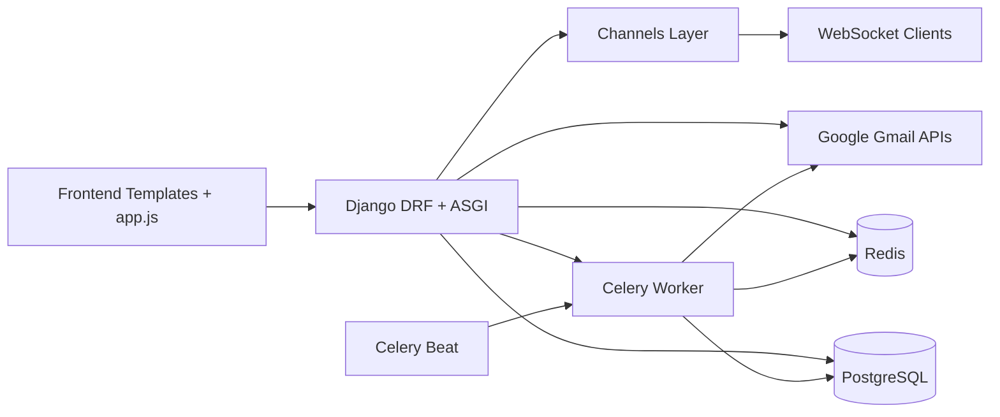
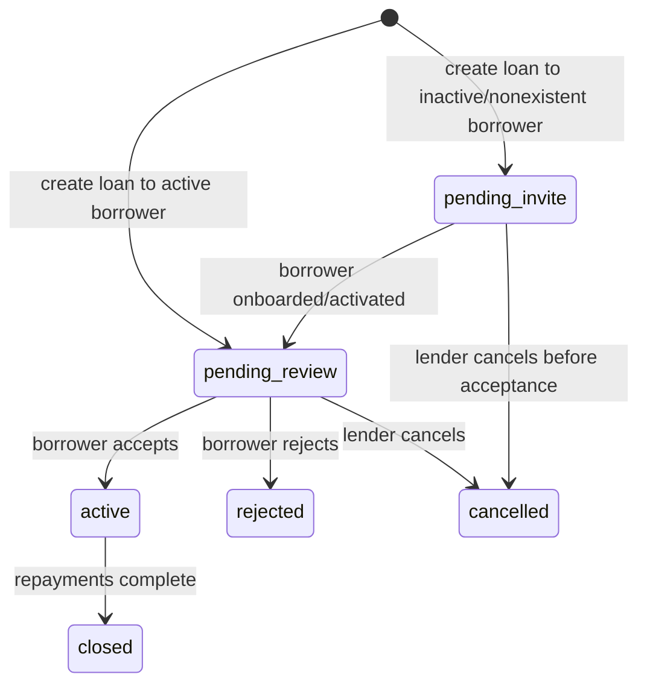
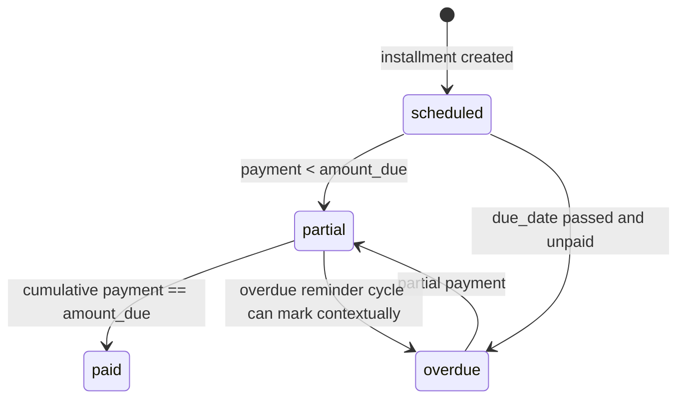
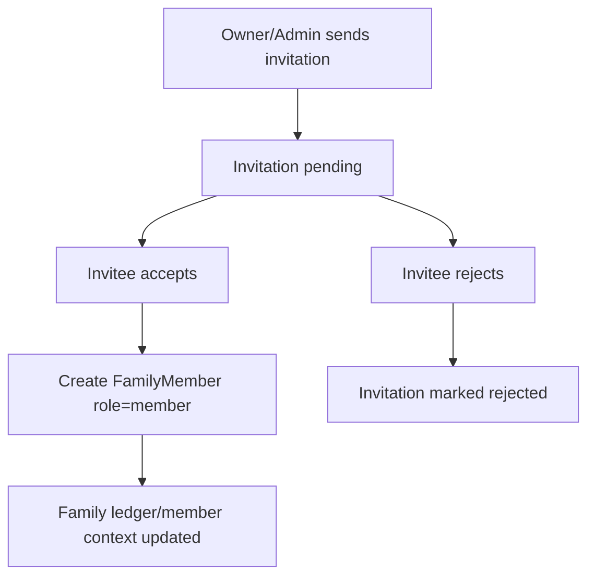
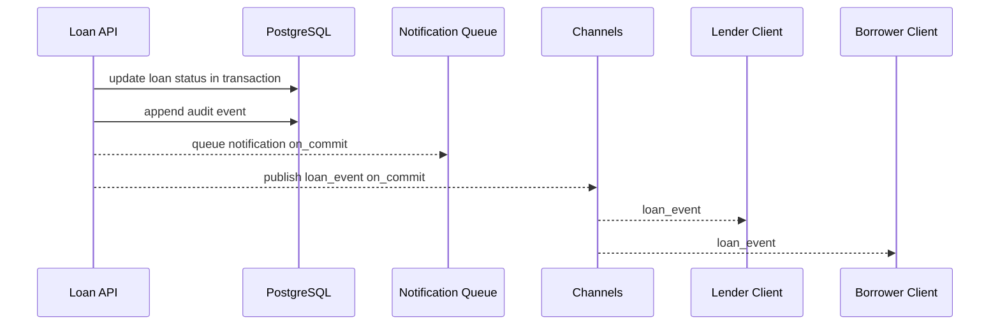

# EXPLAIN.md

## 1. Document Purpose and Method

This document provides an implementation-level explanation of the Peer Lend and Borrow platform in this repository, mapped against the requirement source:

- `Peer_Lend_Borrow_Platform_Final.docx` (re-read and extracted to `qa-report/requirements_extracted.txt`)

The document is written from direct code inspection of the current source tree under `src/` and supporting repository documents.

Scope of this document:

- Requirement-by-requirement traceability
- Exact backend and frontend implementation behavior
- Data model and state machine details
- API surface and behavior
- Async, notifications, websocket, Gmail ingestion internals
- Deployment/testing evidence and gaps

Non-goal:

- This document does not claim behavior that is not implemented in code.

---

## 2. High-Level System Architecture

### 2.1 Technology Stack (Implemented)

Backend:

- Django 5
- Django REST Framework
- PostgreSQL
- JWT via `rest_framework_simplejwt`

Async and scheduling:

- Celery
- Redis (broker + result + cache)
- Celery Beat scheduled jobs

Real-time:

- Django Channels
- Redis channel layer
- JWT-authenticated websocket endpoint

Gmail ingestion:

- Gmail OAuth2 integrations
- Rule-based parser pipeline for transaction alerts
- Ignore parsers for credit-card/EMI/loan/promo categories

Deployment artifacts:

- Dockerfile
- docker-compose stack (web, worker, beat, postgres, redis)
- PgBouncer config in `infra/pgbouncer/`

Frontend/demo client:

- Server-rendered templates + plain JavaScript UI
- API collection under `api-collections/`

### 2.2 Runtime Component Diagram

### 2.3 App Structure and Ownership

Core apps in `src/apps`:

- `accounts`: user identity, auth, account-level Gmail OAuth/sync
- `loans`: loan lifecycle, repayments, websocket loan events
- `payments`: bank transactions, discovered accounts, Gmail ingestion/parsers, reconciliation
- `family`: family creation/invites/members/ledger
- `notifications`: notification records, dedupe, dispatch lifecycle, websocket notification events
- `integrations`: Gmail OAuth callback/connect/status/sync endpoint set (integration-focused path)
- `audit`: append-only state transition events
- `common`: health endpoint, DB test endpoint, frontend route mapping

Support/domain shells present with minimal/no concrete logic in this snapshot:

- `marketplace`
- `communications`
- `risk`
- `compliance`

---

## 3. Configuration and Cross-Cutting Concerns

### 3.1 URL and Routing Topology

Main URL registration is in `src/config/urls.py`:

- Frontend template routes via `apps.common.api.frontend_urls`
- API modules under `/api/v1/*`
- `GET /health/`
- `GET /db-test/` (debug utility)

WebSocket routing:

- `src/config/asgi.py` and `src/config/routing.py`
- endpoint: `/ws/loans/`

### 3.2 Auth and Permission Model

HTTP auth:

- DRF default auth class: JWT bearer (`SIMPLE_JWT`)
- default permission class: authenticated users

Resource-level permission examples:

- `IsAuthenticatedAndActive` across account/loan/family/payment/notifications APIs
- `IsLoanParticipantOrStaff` for loan detail read protection

WebSocket auth:

- JWT token in query parameter `?token=...`
- middleware `apps.loans.websocket_auth.JWTAuthMiddleware`
- closes unauthorized sockets with code `4401`

### 3.3 Transactions and Consistency

- Global DB atomic requests enabled via `DATABASES["default"]["ATOMIC_REQUESTS"] = True`
- Service-layer `@transaction.atomic` for critical transitions (loan creation/accept/reject/cancel, repayment updates, family operations, notifications)
- Select-for-update used on mutable rows in high-contention paths

### 3.4 Async Jobs and Scheduling

Celery beat schedule (in `config/settings/base.py`):

- `notifications.dispatch_pending` every minute
- `loans.send_overdue_reminders` daily at 08:00

### 3.5 Eventing and Realtime Contract

Loan events published through:

- `apps.loans.events.publish_loan_event`
- groups: `loan_{loan_id}`, `loan_user_{borrower_id}`, `loan_user_{lender_id}`

Notification events published through:

- `apps.notifications.events.publish_notification_event`
- group: `loan_user_{user_id}`

Reconnect strategy is explicitly encoded in `apps.loans.reconnect.reconnect_strategy_payload` and returned during websocket `connection_ack`.

---

## 4. Functional Requirement Traceability (Section 4.x)

This section follows the requirement ordering from the DOCX extract.

## 4.1 User and Identity

### Requirement

Each user identified by:

- unique mobile number
- name
- optional profile image
- one or more connected Gmail accounts

### Implementation Overview

Implemented in `apps.accounts`:

- `User` model fields:
  - `mobile_number` (unique, indexed)
  - `name`
  - `profile_image` (optional)
- Gmail account linkage:
  - `accounts.GmailAccount` (user FK, gmail address, token metadata)
  - additional integration model `integrations.GmailAccount` also exists for integration-specific flow

Register/login/me/logout endpoints exist and are functional.

### Backend Flow

Register:

1. `POST /api/v1/accounts/auth/register/`
2. `RegisterSerializer` validates mobile uniqueness and password confirmation
3. `register_user` service creates user (or activates pending invited user)

Login:

1. `POST /api/v1/accounts/auth/login/`
2. `LoginSerializer` authenticates via mobile+password
3. returns access/refresh JWT pair + user payload

### Frontend Flow

- `frontend/login.html` + `frontend/register.html`
- JS controller in `app.js` (`initLogin`, `initRegister`)
- Tokens stored in localStorage and reused for API calls

### Data Model Notes

- Mobile validation uses `accounts.validators.validate_mobile_number`
- `UserManager` handles creation and password setting

### Alignment and Gaps

- Requirement asks for one or more Gmail accounts: implemented
- Identity fields: implemented

---

## 4.2 Loan Creation - Lend Flow

### Requirement

Lender creates loan with borrower mobile, amount in INR, optional note/due date/source ref; idempotent create; status pending acceptance; lender cancel before acceptance.

### Implementation Overview

Implemented in `apps.loans`:

- API: `POST /api/v1/loans/`
- Service: `LoanService.create_loan`
- Idempotency supported (cache record with request fingerprint)

Create payload supports:

- `borrower_id` OR `borrower_mobile_number`
- `principal_amount`
- `currency`
- `interest_rate`
- `repayment_term_months`
- `starts_at`
- `ends_at`
- `purpose`
- `source_transaction_reference`
- `idempotency_key`

### Backend Flow

1. Serializer enforces presence of idempotency key and borrower identity
2. Service validates:
   - positive amount
   - borrower/lender distinct
3. Borrower resolution:
   - existing active user -> `pending_review`
   - existing inactive user -> `pending_invite`
   - missing user -> create inactive placeholder + `pending_invite`
4. Loan row inserted
5. Audit event recorded
6. Notification queued on commit
7. Websocket event published on commit
8. Idempotency result cached by action + key + fingerprint

### Frontend Flow

- `frontend/create-loan.html`
- `initCreateLoan()` posts to `/api/v1/loans/` with generated idempotency key

### Data/Constraint Notes

`Loan` model constraints include:

- principal > 0
- lender != borrower
- end date > start date
- interest between 0 and 100

### Alignment and Gaps

Aligned:

- Different lender/borrower enforced
- Amount > 0 enforced
- Idempotency supported
- Pre-accept cancel supported

Differences vs requirement wording:

- Status name uses `pending_review` rather than `pending_acceptance`
- Currency is generic (`currency`), not locked to INR
- API requires date fields (`starts_at`, `ends_at`) and term/interest; requirement described a lighter payload
- Optional due date is represented via overall schedule dates and repayment entries, not a single optional field

---

## 4.3 Loan Acceptance - Borrow Flow

### Requirement

Borrower sees incoming requests and can accept/reject; until accepted, should not appear in active obligations.

### Implementation Overview

APIs:

- incoming list: `GET /api/v1/loans/incoming/`
- accept: `POST /api/v1/loans/{loan_id}/accept/`
- reject: `POST /api/v1/loans/{loan_id}/reject/`

Service transitions in `LoanService` enforce actor and state validation.

### Backend Flow

Incoming query filters borrower-owned loans with status in:

- `pending_review`
- `pending_invite`

Accept:

- borrower-only guard
- idempotency key required
- status transitioned to active lifecycle state
- audit + notifications + websocket events

Reject:

- borrower-only guard
- rejection reason stored
- audit + notifications + websocket events

### Frontend Flow

- `frontend/loan-list.html` loads incoming list
- `frontend/loan-detail.html` shows accept/reject buttons only if current user is borrower and status is pending

### Alignment and Gaps

- Incoming visibility and accept/reject behavior implemented
- Active list endpoint filters status `active`; pending requests are excluded

---

## 4.4 Repayments

### Requirement

Partial repayments, running balance, no overpayment, settled at zero balance, atomic under concurrency.

### Implementation Overview

Implemented by `RepaymentService` with DB locks:

- create installment: `POST /api/v1/loans/{loan_id}/repayments/`
- apply payment: `POST /api/v1/loans/repayments/{repayment_id}/pay/`

### Backend Flow

Payment path:

1. lock repayment and loan rows (`select_for_update`)
2. reject non-positive payment
3. reject cancelled/rejected loan
4. reject already-paid repayment
5. compute remaining = amount_due - amount_paid
6. reject if payment > remaining
7. update amount_paid and status (`partial` or `paid`)
8. run reconciliation against bank transactions
9. write matched transaction/confidence/manual review flags
10. if all installments paid -> auto-close loan status to `closed`
11. emit audit + notification side effects

### Running Balance

- persisted as derived value from each repayment record (`amount_due - amount_paid`)
- loan-level balance inferred from unpaid installments

### Concurrency

- service method `@transaction.atomic`
- locked rows prevent race overpayment
- installment creation also handles unique conflicts and returns idempotent equivalent when payload matches

### Alignment and Gaps

Aligned:

- partial payments supported
- overpayment blocked
- atomic update strategy implemented

Difference:

- terminal status name is `closed` (requirement says `settled`)

---

## 4.5 Family Links and Family Ledger

### Requirement

Mark family member with relationship label + visibility preference; ledger shows per-member lent/borrowed/net; optional consolidated obligations.

### Implementation Overview

Current implementation is invitation-based family membership, not arbitrary pairwise "link" objects.

Implemented APIs:

- `POST /api/v1/family/create/`
- `GET /api/v1/family/current/`
- `POST /api/v1/family/invitations/`
- `POST /api/v1/family/invitations/{id}/accept/`
- `POST /api/v1/family/invitations/{id}/reject/`
- `POST /api/v1/family/current/members/remove/`
- `GET /api/v1/family/current/ledger/`

### Backend Flow

Ledger generation (`FamilyService.get_family_ledger`):

1. resolve actor's current family
2. verify actor membership
3. collect member IDs
4. aggregate in-family loans excluding non-active terminal statuses
5. compute:
   - `total_lent`
   - `total_borrowed`
   - `net_position`
6. produce `consolidated_obligations` list (`from_user_id`, `to_user_id`, amount, loan_id)

### Frontend Flow

- `frontend/family-ledger.html`
- `initFamilyLedger()` handles create family, invite/remove member, accept/reject invitation actions, and ledger load

### Alignment and Gaps

Aligned:

- family grouping and ledger netting implemented
- consolidated obligations implemented

Differences:

- no `relationship_label` field
- no explicit visibility preference field
- modeling is full family entity + role membership (`owner/admin/member`) rather than direct link tuples

---

## 4.6 Savings/Current Account Email Ingestion

### Requirement

Ingest savings/current alerts from Gmail; include debit/credit channels; exclude credit-card/EMI/loan/promo/cross-sell; store full transaction record.

### Implementation Overview

Implemented in `payments` + `integrations` + `accounts` services:

- parser pipeline (`GmailTransactionParserPipeline`)
- ingestion orchestration (`GmailIngestionService`)
- sync trigger APIs (`/integrations/gmail/sync/` and `/accounts/auth/gmail/sync/`)

### Parsing Architecture

Ignore stage first:

- `CreditCardIgnoreParser`
- `MarketingIgnoreParser`
- `LoanIgnoreParser`
- `EMIIgnoreParser`

Then transaction parsers:

- UPI
- NEFT
- RTGS
- ATM
- debit parser
- credit parser

### Stored Transaction Fields

`BankTransaction` stores:

- amount
- transaction date
- narration
- direction (debit/credit)
- account number (masked pattern from hints)
- bank
- account type
- source (`gmail` or `manual`)
- raw email reference id

### Sender Whitelist

Whitelisted domains configured in `GMAIL_BANK_SENDER_DOMAINS` in settings.

### Duplicate Handling

If Gmail message id already exists for a user and source gmail, ingestion is skipped as duplicate.

### Alignment and Gaps

Aligned:

- Gmail OAuth + fetch + parse + persist flow exists
- ignore classes cover required categories
- transaction fields required by spec are present

Caveat:

- parsing is deterministic regex/rule-based; coverage depends on parser fixtures and templates

---

## 4.7 Bank Account Discovery from Gmail

### Requirement

Detect unlinked bank accounts from emails; store status/metadata; allow dismiss/link; prevent repeated prompt after dismissed/linked.

### Implementation Overview

Implemented with `DiscoveredAccount` and status transitions.

Stored fields:

- `bank`
- `account_type`
- `account_number` (masked)
- `first_seen_at`
- `supporting_email_count`
- `status` (`unlinked`, `dismissed`, `linked`)

APIs:

- list: `GET /api/v1/payments/discovered-accounts/`
- discover manual: `POST /api/v1/payments/discovered-accounts/discover/`
- transition: `POST /api/v1/payments/discovered-accounts/{id}/{action}/`

### Backend Behavior

- unique constraint avoids duplicate account records per user+bank+account+type
- ingestion path increments supporting email count for repeated sightings
- default list endpoint returns unlinked suggestions

### Frontend Flow

- `frontend/discovered-accounts.html`
- action buttons for Link/Dismiss/Unlink call status API
- Gmail connect + sync controls in same screen

### Alignment and Gaps

Aligned:

- discovery, statuses, dismiss/link workflow implemented
- dismissed/linked not returned by default unlinked list

Partial:

- explicit anti-confusion logic for credit-card last4 vs account last4 is mostly achieved through ignore parsers and account-type gating, but no dedicated classifier object is present

---

## 4.8 Notifications

### Requirement

Notify on loan lifecycle, repayments, settlement, overdue, new bank account discovery; each with dedupe key.

### Implementation Overview

`NotificationService.create_notification` supports dedupe by `(user_id, dedupe_key)` (returns existing latest if duplicate).

State model:

- `pending`
- `sent`
- `failed`

### Trigger Sources (Implemented)

Loan/family/repayment flows enqueue notifications through service/task helpers.

Explicit triggers observed in code:

- loan created/accepted/rejected/cancelled
- repayment created/completed
- loan settled/closed
- overdue reminders
- family invitation events and member changes

Dispatch:

- notifications are created pending
- beat/worker sends pending notifications via `dispatch_pending_notifications_task`

### Alignment and Gaps

Aligned:

- dedupe key exists and is used
- lifecycle notifications broadly implemented

Gap:

- explicit dedicated "new bank account discovered" notification call is not currently observed in discovery service; discovery is persisted but not always surfaced as a notification record by default path

---

## 4.9 Real-Time WebSocket Updates

### Requirement

Push loan events to lender and borrower on state change; auth required; party isolation; reconnect and missed-event strategy documented.

### Implementation Overview

Endpoint:

- `/ws/loans/`

Auth:

- JWT token query param validated in middleware

Party isolation:

- events sent to user groups `loan_user_{id}` for borrower/lender
- optional loan-specific group subscriptions `loan_{loan_id}` from client actions

Supported event families in code:

- `loan.created`
- `loan.accepted`
- `loan.rejected`
- `loan.cancelled`
- settlement/close events triggered through repayment pipeline

### Missed Event / Reconnect Strategy

Implemented strategy payload:

- exponential backoff with jitter
- initial delay 1000ms
- max delay 30000ms
- max attempts 20

Client app.js reconnects websocket and refreshes list/detail views when events arrive.

### Alignment and Gaps

Aligned:

- websocket auth present
- per-user event scoping present
- reconnect strategy explicitly provided

Gap:

- no persisted websocket offset/sequence replay API for deterministic missed-event recovery; current strategy relies on reconnect + REST refresh

---

## 4.10 Transaction Reconciliation

### Requirement

Match repayment against bank transactions using amount/date/direction/narration/reference; confidence levels high/medium/low; unmatched -> manual review; never auto-settle without user confirmation.

### Implementation Overview

Matching implemented in `payments.services.reconciliation_service.ReconciliationService.match_repayment_transaction`.

Matching signals:

- amount exact match
- date window proximity (+/- 5 days)
- debit direction
- linked account filter (only linked savings/current)
- narration contains transaction reference bonus

Confidence mapping:

- high
- medium
- low

Repayment stores:

- matched transaction FK
- confidence
- manual review flag

### Alignment and Gaps

Aligned:

- confidence tiers implemented
- unmatched with provided reference sets manual review
- linked accounts only for matching

Important difference:

- code auto-closes loan when all installments are paid (`_auto_settle_loan_if_fully_paid`) without an explicit separate user confirmation step. This diverges from requirement text "Never auto-settle a loan without user confirmation."

---

## 4.11 Audit Trail

### Requirement

Append-only event log for major state changes; include timestamp, actor, event type, entity reference, payload snapshot.

### Implementation Overview

`audit.AuditEvent` is append-only via insert-only service usage.

Fields:

- `entity_type`
- `entity_id`
- `field_name`
- `from_state`
- `to_state`
- `actor`
- `metadata`
- `occurred_at`

`AuditEventService.record_state_change` is called across loans, repayments, notifications, family, Gmail ingestion/discovery flows.

### Alignment and Gaps

Aligned:

- append-only state transition storage exists
- actor/entity/payload timestamp captured

Difference:

- event typing is represented as `entity_type` + `field_name` + metadata `action`, not a single canonical `event_type` column

---

## 5. API Expectations Mapping (Section 5)

Below is requirement-to-endpoint mapping in current implementation.

### 5.1 Loan APIs

Implemented:

- create loan: `POST /api/v1/loans/`
- list loans: `GET /api/v1/loans/list/`
- loan detail + repayment history: `GET /api/v1/loans/{id}/`
- accept/reject: `POST /api/v1/loans/{loan_id}/accept/`, `.../reject/`
- repay: `POST /api/v1/loans/repayments/{repayment_id}/pay/`
- cancel pending loan: `POST /api/v1/loans/{loan_id}/cancel/`

Partial notes:

- filtering exists through specialized endpoints (`incoming/lent/borrowed/active/settled`)
- generic query param filter contract is minimal

### 5.2 Family APIs

Implemented but with family model rather than direct user links:

- create family: `POST /api/v1/family/create/`
- invite/accept/reject member flow
- remove member
- ledger retrieval

No direct endpoint names matching "add/remove family link" phrasing, but equivalent outcome exists through invitation/member management.

### 5.3 Gmail and Transaction APIs

Implemented:

- Gmail connect/callback/status/sync under `/api/v1/integrations/gmail/*`
- account-level Gmail sync also under `/api/v1/accounts/auth/gmail/*`
- list ingested transactions: `GET /api/v1/payments/transactions/`
- discovered accounts list/status transitions

### 5.4 Health Endpoint

Implemented:

- `GET /health/`

---

## 6. Edge Case Handling (Section 6)

### 6.1 Borrower not on platform

Handled:

- placeholder inactive user created
- loan status set `pending_invite`
- register flow upgrades same mobile user record to active

### 6.2 Concurrent repayment requests

Handled:

- row locking + atomic service
- overpay protection after lock

### 6.3 Unauthorized loan detail access by guessed ID

Handled:

- object permission `IsLoanParticipantOrStaff`

### 6.4 Overpayment attempts

Handled:

- explicit check payment > remaining -> validation error

### 6.5 Duplicate Gmail alert parse

Handled:

- duplicate check on raw email reference id for gmail source

### 6.6 Credit-card misclassification

Partially handled:

- ignore parser stage for credit card patterns
- quality depends on parser rules and fixtures

### 6.7 Last-4 collision between card and account

Partially handled:

- account discovery and reconciliation limited to account type + linked account constraints
- no dedicated collision disambiguation service beyond parser categorization

### 6.8 Dismissed discovered account then new emails

Handled:

- same discovered account record reused and email count may increment
- default UI listing focuses on unlinked status

### 6.9 Gmail token expired

Handled:

- refresh token flow in OAuth service
- raises explicit errors when refresh unavailable

### 6.10 Loans with no due date

Partially handled:

- repayment installment due_date is required when creating installment
- loan has starts/ends dates mandatory
- no null due-date loan abstraction

### 6.11 WebSocket client offline during status change

Partially handled:

- reconnect strategy and UI rest refresh on reconnect
- no durable event replay cursor API

---

## 7. AWS Deployment Requirement Mapping (Section 7)

## 7.1 Repository Artifacts Present

- `Dockerfile`
- `docker-compose.yml`
- PgBouncer assets in `infra/pgbouncer/`
- multiple deployment/testing notes and AWS QA report

## 7.2 Runtime Infrastructure Intent

The required target architecture (ALB -> ECS API/ASGI + ECS worker/beat + PgBouncer -> RDS + ElastiCache) is consistent with project documents and folder artifacts.

## 7.3 Current Documentation State

Requirement asks for `DEPLOY.md` including architecture diagram and PgBouncer rationale.

Current repository observation:

- `DEPLOY.md` file is not present in current workspace snapshot

Impact:

- deployment explanation exists across other docs/reports but not in the exact required deliverable filename

---

## 8. Testing Requirement Mapping (Section 8)

## 8.1 Test Suites Present

Representative test modules discovered:

- auth and Gmail OAuth API tests
- loan API tests
- repayment API tests
- channels auth tests
- websocket event tests
- notification service/model/task/event/api tests
- family API tests
- parser pipeline tests
- discovered account API tests
- audit model/service tests
- health endpoint tests

## 8.2 Requirement Coverage

Covered:

- loan transitions and APIs
- repayment and overpay constraints
- idempotency path for loan creation
- parser fixtures and ignore behavior
- discovered account flow
- permission failures in APIs
- websocket/auth-related tests (bonus)
- celery task tests for notifications (bonus)
- family ledger/family APIs (bonus)

## 8.3 Execution Notes

Primary documented command:

- `python manage.py test --settings=config.settings.test`

---

## 9. Detailed Data Model Explanation

## 9.1 Accounts Domain

### `accounts.User`

Purpose:

- core identity object across all domains

Key constraints:

- unique mobile number

Relationships:

- one-to-many with loans as borrower/lender
- one-to-many with gmail accounts
- one-to-many with notifications and audit actor refs

### `accounts.GmailAccount` and `accounts.GmailSyncedEmail`

Purpose:

- account-level Gmail linkage and synced email metadata snapshot

Key points:

- gmail address unique globally
- optional primary account flag
- token expiry tracking
- message uniqueness per gmail account + message id

## 9.2 Loans Domain

### `loans.Loan`

Purpose:

- represents principal agreement and lifecycle

Primary lifecycle statuses:

- `pending_invite`, `pending_review`, `active`, `rejected`, `cancelled`, `closed` (plus draft/approved/disbursed in enum)

Important constraints:

- principal > 0
- end date after start date
- lender != borrower

### `loans.Repayment`

Purpose:

- installment-level repayment and reconciliation status

Key fields:

- `amount_due`, `amount_paid`, `status`, `paid_at`
- `transaction_reference`
- `matched_transaction`, `match_confidence`, `requires_manual_review`

Constraints:

- unique installment number per loan
- `amount_paid <= amount_due`
- status consistency checks in `clean()`

## 9.3 Payments Domain

### `payments.BankTransaction`

Purpose:

- normalized transaction store from manual entry and Gmail ingestion

Notable constraints:

- positive amount
- raw email reference only valid for source `gmail`

### `payments.DiscoveredAccount`

Purpose:

- user-visible suggestions for unlinked bank accounts detected via Gmail

Unique key:

- `(user, account_number, bank, account_type)`

Status lifecycle:

- `unlinked -> linked/dismissed`, and reversible via action APIs

## 9.4 Family Domain

### `family.Family`

Purpose:

- group boundary for ledger calculations

### `family.FamilyMember`

Purpose:

- membership with role (`owner/admin/member`)

Unique constraint:

- one membership per (family, user)

### `family.FamilyInvitation`

Purpose:

- pending invite workflow before membership

Unique pending constraint:

- one pending invite per (family, invited_user)

### `family.FamilyLedgerEntry`

Purpose:

- records membership changes and other ledger actions

## 9.5 Notifications Domain

### `notifications.Notification`

Purpose:

- asynchronous user messaging with dedupe and status workflow

Dedupe strategy:

- service checks existing `(user, dedupe_key)` and reuses record

## 9.6 Audit Domain

### `audit.AuditEvent`

Purpose:

- append-only auditable trail for state changes

Indexes support:

- entity lookup
- actor timeline
- field/time analysis

---

## 10. State Machines and Flow Diagrams

## 10.1 Loan State Machine (Implemented Semantics)

## 10.2 Repayment State Machine

## 10.3 Family Invitation and Membership Flow

## 10.4 Loan Event Push Sequence

---

## 11. Backend Request Flows (End-to-End)

## 11.1 Create Loan Flow

1. JWT auth validated
2. serializer validation (borrower identity + idempotency)
3. business validation in service
4. borrower resolution by id/mobile
5. create loan row
6. enqueue notification
7. publish websocket event
8. return serialized loan + repayment history field (possibly empty)

## 11.2 Accept Loan Flow

1. borrower invokes accept endpoint with idempotency key
2. service checks ownership and current state
3. status transition to active path
4. audit and notification side effects
5. websocket update pushed to both parties

## 11.3 Repayment Payment Flow with Reconciliation

1. lock repayment and loan
2. enforce no overpay
3. update amount/status timestamps
4. run transaction match against linked bank accounts
5. persist match confidence and manual review flag
6. auto-close loan when all repayments paid
7. notify lender on completed installment and settlement

## 11.4 Gmail Sync Flow

1. resolve connected Gmail account
2. refresh token if expired
3. list message IDs
4. fetch full messages
5. parse metadata and plain text body
6. upsert discovered email record
7. ingest transaction via pipeline
8. create/update discovered accounts
9. update sync stats and last sync timestamp

---

## 12. Frontend Flow Explanation

Frontend stack:

- Django templates under `src/templates/frontend`
- shared script `src/apps/common/static/frontend/app.js`

Navigation pages:

- login/register
- dashboard
- create loan
- loan list/detail
- repayment
- family ledger
- transactions
- discovered accounts + Gmail sync
- notifications

Core frontend behaviors:

- token refresh before websocket open
- auth token persistence in localStorage
- idempotency keys generated client-side for loan state actions
- websocket listeners trigger list/detail/dashboard refreshes for eventual consistency

Security note:

- token in query param for websocket is supported by backend middleware and should be carefully handled in production logging layers

---

## 13. API Catalog (Current Source of Truth)

## 13.1 Accounts

- `POST /api/v1/accounts/auth/register/`
- `POST /api/v1/accounts/auth/login/`
- `POST /api/v1/accounts/auth/token/refresh/`
- `GET /api/v1/accounts/auth/me/`
- `POST /api/v1/accounts/auth/logout/`
- `GET /api/v1/accounts/auth/gmail/accounts/`
- `POST /api/v1/accounts/auth/gmail/connect/`
- `POST /api/v1/accounts/auth/gmail/refresh/`
- `POST /api/v1/accounts/auth/gmail/sync/`

## 13.2 Loans

- `POST /api/v1/loans/`
- `GET /api/v1/loans/list/`
- `GET /api/v1/loans/incoming/`
- `GET /api/v1/loans/lent/`
- `GET /api/v1/loans/borrowed/`
- `GET /api/v1/loans/active/`
- `GET /api/v1/loans/settled/`
- `GET /api/v1/loans/{id}/`
- `POST /api/v1/loans/{loan_id}/accept/`
- `POST /api/v1/loans/{loan_id}/reject/`
- `POST /api/v1/loans/{loan_id}/cancel/`
- `POST /api/v1/loans/{loan_id}/repayments/`
- `POST /api/v1/loans/repayments/{repayment_id}/pay/`

## 13.3 Family

- `POST /api/v1/family/create/`
- `GET /api/v1/family/current/`
- `GET /api/v1/family/current/ledger/`
- `POST /api/v1/family/current/members/remove/`
- `GET /api/v1/family/invitations/`
- `POST /api/v1/family/invitations/`
- `POST /api/v1/family/invitations/create/`
- `POST /api/v1/family/invitations/{invitation_id}/accept/`
- `POST /api/v1/family/invitations/{invitation_id}/reject/`

## 13.4 Payments

- `GET /api/v1/payments/transactions/`
- `POST /api/v1/payments/transactions/create/`
- `GET /api/v1/payments/transactions/summary/`
- `GET /api/v1/payments/discovered-accounts/`
- `POST /api/v1/payments/discovered-accounts/discover/`
- `POST /api/v1/payments/discovered-accounts/{account_id}/{linked|dismissed|unlinked}/`

## 13.5 Integrations

- `GET /api/v1/integrations/gmail/connect/`
- `GET /api/v1/integrations/gmail/callback/`
- `GET /api/v1/integrations/gmail/status/`
- `POST /api/v1/integrations/gmail/sync/`
- `GET /api/v1/integrations/gmail/messages/`

## 13.6 Notifications

- `GET /api/v1/notifications/`
- `POST /api/v1/notifications/create/`
- `GET /api/v1/notifications/{id}/`
- `POST /api/v1/notifications/{notification_id}/send/`
- `POST /api/v1/notifications/{notification_id}/fail/`

## 13.7 Common

- `GET /health/`
- `GET /db-test/`

## 13.8 WebSocket

- `/ws/loans/?token=<jwt>`

---

## 14. Requirement 3 (Tech Stack) Compliance Matrix

| Requirement | Implementation Status | Evidence |
|---|---|---|
| Django | Implemented | `config/settings/base.py`, `manage.py` |
| DRF | Implemented | DRF settings + API views/serializers |
| PostgreSQL | Implemented | DB config + docker compose postgres service |
| JWT simplejwt | Implemented | `REST_FRAMEWORK` + `SIMPLE_JWT` |
| Celery | Implemented | `config/celery.py`, tasks in apps |
| Redis | Implemented | cache, celery broker, channels layer |
| Celery Beat scheduled job | Implemented | notifications + overdue reminder schedules |
| Channels/websocket | Implemented | ASGI + consumers + routing |
| Gmail OAuth/fixtures | Implemented | OAuth services + parser fixtures/tests |
| Ignore unwanted email categories | Implemented | ignore parser pipeline |
| Docker | Implemented | `Dockerfile`, `docker-compose.yml` |
| ECR/ECS/RDS/ElastiCache/PgBouncer/Actions | Partially documented in repo assets | infra files and reports exist; formal `DEPLOY.md` missing in current tree |
| Frontend/demo client | Implemented | template UI and Postman/Bruno collection |

---

## 15. Requirement 9 (Deliverables) Compliance Matrix

| Deliverable | Current Status |
|---|---|
| GitHub repository with backend + demo client + docker + local pgbouncer | Present |
| README with approach/assumptions/lifecycle/parsing/local run | Present (`README.md`) |
| DESIGN.md with diagrams/security/event contract | Present (`DESIGN.md`) |
| DEPLOY.md with AWS diagram + PgBouncer + live URL + health | Not present as `DEPLOY.md` in current snapshot |
| Seed scripts and sample data | Seed command and fixture references present |

---

## 16. Security, Privacy, and Operational Notes

Authentication and authorization:

- JWT enforced for APIs and websockets
- object-level loan detail access control prevents ID-guess reads

Data handling:

- account numbers stored masked format in discovered/ingested paths
- raw email IDs retained for dedupe traceability

Operational resilience:

- transaction boundaries protect state transitions
- async notifications and beat dispatch avoid inline latency spikes

Known risk hotspots:

- token-in-query websocket auth requires strict log hygiene
- auto-close without explicit user settle confirmation may not align with stricter financial governance requirements

---

## 17. Assumptions and Explicit Deviations from Requirement Text

1. Loan status naming:
- Requirement uses `pending_acceptance` / `settled`
- Implementation uses `pending_review` / `closed`

2. Loan creation payload:
- Requirement presents minimal lend fields
- Implementation requires richer financial fields (currency, dates, term, interest)

3. Family model:
- Requirement asks direct family link metadata (relationship/visibility)
- Implementation uses family entity + role membership + invitation workflow

4. Reconciliation settle policy:
- Requirement says do not auto-settle without confirmation
- Implementation auto-closes on full paid repayments

5. Deployment document filename:
- Requirement mandates `DEPLOY.md`
- file not present in this snapshot

---

## 18. Practical Walkthrough of Major User Journeys

## 18.1 Lender Creates Loan to Existing User

1. Lender logs in and opens create-loan page
2. submits borrower user id/mobile and loan terms
3. API creates pending loan and emits event
4. borrower sees request in incoming list

## 18.2 Borrower Accepts and Repays in Parts

1. Borrower accepts pending request
2. Loan becomes active
3. Lender creates repayment installment(s)
4. Borrower submits partial payments
5. repayment status transitions partial -> paid
6. all installments paid -> loan closes

## 18.3 Gmail-Driven Transaction and Account Discovery

1. User connects Gmail
2. User triggers sync
3. Emails fetched and parsed
4. valid transaction alerts become `BankTransaction`
5. previously unseen account fingerprints become `DiscoveredAccount`
6. user links or dismisses discovered account suggestions

## 18.4 Family Ledger

1. User creates family and invites members
2. Invitees accept/reject
3. Ledger endpoint aggregates in-family active obligations
4. UI shows per-member totals and net position

---

## 19. Suggested Engineering Improvements (Post-Requirement Hardening)

1. Introduce explicit canonical event_type enum in audit table.
2. Add durable websocket missed-event replay endpoint with sequence cursor.
3. Add explicit manual confirmation workflow before final settle transition.
4. Add direct relationship label and visibility fields if strict requirement compliance is mandatory.
5. Provide strict INR default/validation mode when country profile requires it.
6. Consolidate duplicate Gmail account concepts between `accounts` and `integrations` domains to reduce cognitive overhead.
7. Add `DEPLOY.md` with exact AWS architecture, pool sizing rationale, and CI/CD details in required format.

---

## 20. Appendix A - Key Source Files Reviewed

Configuration:

- `src/config/urls.py`
- `src/config/asgi.py`
- `src/config/routing.py`
- `src/config/settings/base.py`
- `src/config/celery.py`

Accounts:

- `src/apps/accounts/models.py`
- `src/apps/accounts/api/urls.py`
- `src/apps/accounts/api/views.py`
- `src/apps/accounts/api/serializers.py`
- `src/apps/accounts/services/auth_service.py`
- `src/apps/accounts/services/gmail_oauth_service.py`

Loans:

- `src/apps/loans/models.py`
- `src/apps/loans/choices.py`
- `src/apps/loans/api/urls.py`
- `src/apps/loans/api/views.py`
- `src/apps/loans/api/serializers.py`
- `src/apps/loans/api/permissions.py`
- `src/apps/loans/services/loan_service.py`
- `src/apps/loans/services/repayment_service.py`
- `src/apps/loans/events.py`
- `src/apps/loans/consumers.py`
- `src/apps/loans/websocket_auth.py`
- `src/apps/loans/reconnect.py`
- `src/apps/loans/tasks.py`

Payments and Gmail parsing:

- `src/apps/payments/models.py`
- `src/apps/payments/api/urls.py`
- `src/apps/payments/api/views.py`
- `src/apps/payments/api/serializers.py`
- `src/apps/payments/api/transaction_views.py`
- `src/apps/payments/api/transaction_serializers.py`
- `src/apps/payments/services/transaction_service.py`
- `src/apps/payments/services/reconciliation_service.py`
- `src/apps/payments/services/discovered_account_service.py`
- `src/apps/payments/services/gmail_ingestion_service.py`
- `src/apps/payments/services/gmail_parsers/pipeline.py`

Integrations:

- `src/apps/integrations/models.py`
- `src/apps/integrations/api/urls.py`
- `src/apps/integrations/api/views.py`
- `src/apps/integrations/api/serializers.py`
- `src/apps/integrations/services/gmail_sync.py`
- `src/apps/integrations/services/gmail_parser.py`
- `src/apps/integrations/tasks.py`

Family:

- `src/apps/family/models.py`
- `src/apps/family/api/urls.py`
- `src/apps/family/api/views.py`
- `src/apps/family/api/serializers.py`
- `src/apps/family/api/permissions.py`
- `src/apps/family/services/family_service.py`

Notifications and audit:

- `src/apps/notifications/models.py`
- `src/apps/notifications/api/urls.py`
- `src/apps/notifications/api/views.py`
- `src/apps/notifications/api/serializers.py`
- `src/apps/notifications/services/notification_service.py`
- `src/apps/notifications/events.py`
- `src/apps/notifications/tasks.py`
- `src/apps/audit/models.py`
- `src/apps/audit/services/audit_event_service.py`

Frontend:

- `src/templates/frontend/base.html`
- `src/templates/frontend/login.html`
- `src/templates/frontend/register.html`
- `src/templates/frontend/dashboard.html`
- `src/templates/frontend/create-loan.html`
- `src/templates/frontend/loan-list.html`
- `src/templates/frontend/loan-detail.html`
- `src/templates/frontend/repayment.html`
- `src/templates/frontend/family-ledger.html`
- `src/templates/frontend/transactions.html`
- `src/templates/frontend/discovered-accounts.html`
- `src/templates/frontend/notifications.html`
- `src/apps/common/static/frontend/app.js`

Repository docs and artifacts:

- `README.md`
- `DESIGN.md`
- `DATABASE.md`
- `API.md`
- `TESTING.md`
- `RUN_COMMANDS.md`
- `docker-compose.yml`
- `Dockerfile`
- `qa-report/requirements_extracted.txt`

---

## 21. Appendix B - Readiness Summary

Implemented strongly:

- core auth + user identity
- loan lifecycle (create/accept/reject/cancel)
- repayment lifecycle with overpay protection and concurrency control
- family invitation and ledger
- Gmail ingest + parser ignore categories + discovered accounts
- notifications with dedupe and dispatch
- websocket push and reconnect guidance
- audit trail across major transitions

Primary compliance deltas to address for strict requirement parity:

- add `DEPLOY.md` in required format
- align nomenclature and possibly API contract with requirement status names/fields
- add explicit "manual confirmation before settle" if requirement interpreted strictly
- add explicit relationship and visibility metadata for family link semantics

This closes the implementation explanation based on current repository state.
